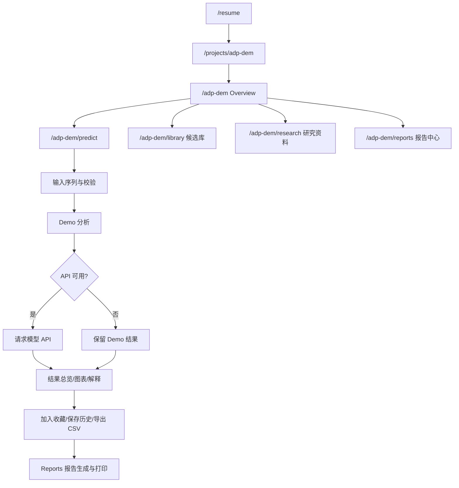

# ADP_DEM_REVIEW_PACK

> 生成时间：2026-05-16  
> 审阅范围：当前工作区 `C:\Users\a1933\Desktop\智能医学课程网站` 中 ADP-DEM 模块代码（`app/adp-dem`、`components/adp-dem`、`lib/adp-dem`、`public/adp-dem`）  
> 说明：本审阅基于“当前代码现状”，不依赖外部后端仓库

## 一、项目基本信息
- 网站名称：ADP-DEM 抗糖尿病肽智能预测平台
- 网站定位：以“预测工作流”为核心的多模态肽序列分析展示平台（前端主导，后端可选接入）
- 目标用户：
  - 医学/生物信息方向老师与评审
  - 算法/产品评审者
  - 对抗糖尿病肽候选筛选感兴趣的研究者
- 核心场景：
  - 单条序列分析与解释
  - 批量序列筛选
  - 候选库检索、收藏、报告导出
- 一句话说明：把“抗糖尿病肽候选发现”流程可视化为可交互工作台，支持从输入到解释再到报告输出。
- 当前最重要 3 个功能：
  - `Prediction Workbench`（单条/批量/对比/突变）
  - `Library`（候选库 + Top 排行 + 对接结果 + 收藏）
  - `Reports`（历史、批量任务、报告草稿、打印导出）

## 二、路由与导航结构

### 2.1 全部路由清单（ADP-DEM）
| 路由路径 | 页面名称 | 页面定位 | 主要功能 | 核心页面 | 建议保留 | 合并/重命名建议 |
|---|---|---|---|---|---|---|
| `/adp-dem` | Overview | 平台入口页 | 平台定位、核心指标、主流程、CTA | 是 | 是 | 可维持 |
| `/adp-dem/predict` | Predict | 核心工作台 | 单条预测、批量预测、序列对比、突变扫描 | 是 | 是 | 可维持 |
| `/adp-dem/library` | Library | 候选数据中心 | 全部候选、Top 排行、分子对接、收藏候选 | 是 | 是 | 可维持 |
| `/adp-dem/research` | Research | 学术资料页 | 模型流程、数据集、性能、消融、论文资料 | 次核心 | 是 | 可维持 |
| `/adp-dem/reports` | Reports | 报告与资产管理 | 历史、批量任务、报告草稿、打印/Markdown、本地数据管理 | 是 | 是 | 可维持 |
| `/adp-dem/batch` | Legacy Batch | 兼容跳转 | 重定向到 `/adp-dem/predict?tab=batch` | 否 | 是（兼容期） | 后续可下线 |
| `/adp-dem/history` | Legacy History | 兼容跳转 | 重定向到 `/adp-dem/reports` | 否 | 是（兼容期） | 后续可下线 |
| `/adp-dem/results` | Legacy Results | 兼容跳转 | 重定向到 `/adp-dem/library` | 否 | 是（兼容期） | 后续可下线 |
| `/adp-dem/method` | Legacy Method | 兼容跳转 | 重定向到 `/adp-dem/research` | 否 | 是（兼容期） | 后续可下线 |
| `/adp-dem/paper` | Legacy Paper | 兼容跳转 | 重定向到 `/adp-dem/research?tab=paper` | 否 | 是（兼容期） | 后续可下线 |

### 2.2 当前导航入口
- 当前导航栏入口：`概览 / 预测 / 候选库 / 研究 / 报告`，另有 `返回简历`
- 入口是否过多：当前不多，已压缩为 5 个一级入口，结构清晰
- 是否建议改为“概览/预测/候选库/研究/报告”：**当前代码已经是该结构**

## 三、页面截图清单

### 3.1 建议截图页面
- `/adp-dem` 桌面端
- `/adp-dem/predict` 桌面端
- `/adp-dem/batch` 桌面端（会重定向）
- `/adp-dem/history` 桌面端（会重定向）
- `/adp-dem/results` 桌面端（会重定向）
- `/adp-dem/method` 桌面端（会重定向）
- `/adp-dem/paper` 桌面端（会重定向）
- 首页移动端
- 预测页移动端

### 3.2 本地截图状态
- 已创建目录：`/review-screenshots/`
- 当前会话未直接产出浏览器截图文件（本次工具链未直接执行本地页面截图自动化）
- 建议人工补拍并命名：
  - `01-overview-desktop.png`
  - `02-predict-desktop.png`
  - `03-batch-redirect-desktop.png`
  - `04-history-redirect-desktop.png`
  - `05-results-redirect-desktop.png`
  - `06-method-redirect-desktop.png`
  - `07-paper-redirect-desktop.png`
  - `08-overview-mobile.png`
  - `09-predict-mobile.png`

## 四、核心用户流程

### 4.1 单条预测流程（文字）
1. 用户输入序列（文本或文件读取首条序列）
2. 前端执行清洗与校验（去空格/换行、转大写、氨基酸合法性）
3. 先做 Demo 预测（性质 + 候选匹配 + 启发式）
4. 若配置 `NEXT_PUBLIC_ADP_API_URL`，再请求后端模型覆盖结果
5. 展示结果总览、图表、解释文本、相似候选
6. 支持收藏、保存历史、CSV、报告草稿、打印

### 4.2 批量预测流程（文字）
1. 解析输入（多行/FASTA/CSV/TXT）
2. 每条先做 Demo 校验与基础分析，统计无效序列
3. 若后端可用优先请求批量接口（`/batch-predict` 或 `/batch_predict`）
4. 批量失败则逐条请求后端
5. 合并结果并写入历史、生成批量任务摘要
6. 支持筛选与多种 CSV 导出 + 打印报告

### 4.3 候选库查看流程
1. 进入 Library
2. 在“全部候选”按搜索/长度/排序筛选
3. 可复制序列、加入收藏、加入报告、跳去预测
4. 在 Top/Docking/Favorites 标签继续深入

### 4.4 历史记录流程
1. Predict 结果写入 `localStorage` 历史
2. Reports > 历史预测 读取并筛选
3. 可再次预测、删除、导出 CSV、清空

### 4.5 导出报告流程
1. 在 Predict/Library 将项目加入报告草稿
2. Reports > 导出报告 汇总草稿项
3. 选择打印（浏览器 PDF）或复制 Markdown 摘要

### 4.6 简历页跳转流程
1. 用户从 `/resume` 进入项目（`/projects/adp-dem`）
2. 该路由重定向到 `/adp-dem`
3. 任意 ADP-DEM 页可通过导航“返回简历”回到 `/resume`

### 4.7 Mermaid 流程图


## 五、预测逻辑审阅

### 5.1 结论
- 是否调用真实模型 API：**支持，可选**
- 是否支持 `NEXT_PUBLIC_ADP_API_URL`：**支持**
- API 失败处理：**自动回退 Demo**
- 是否存在本地轻量估计：**存在（启发式评分）**
- 是否显示“伪概率”：**已控制，离线模式不显示模型概率**
- 是否有“伪造真实模型预测”风险：**当前已明显降低**，但若后端返回字段语义不一致仍需后端契约约束

### 5.2 API 请求格式
- 单条请求：`POST {base}/predict`（或 `base`）
```json
{ "sequence": "RVIPAAVVGAAVAGGL" }
```
- 批量请求：`POST {base}/batch-predict`（或 `/batch_predict`）
```json
{ "sequences": ["SEQ1", "SEQ2"] }
```

### 5.3 API 响应格式（前端兼容）
- 单条可兼容字段：`modelProbability/probability/score/prediction`、`stage1Score`、`stage2Score`、`candidateRank/rank`、`modelVersion`、`dataVersion`
- 批量可兼容：`results` 或 `data` 数组

### 5.4 high / medium / low 判定
- `probability >= 0.8` => `high`
- `0.6 <= probability < 0.8` => `medium`
- `< 0.6` => `low`
- 无概率 => `unknown`

### 5.5 本地轻量规则
- 校验与清洗
- 理化性质计算（长度、疏水、极性、芳香、净电荷）
- 候选库精确命中 + 相似度检索（序列位点相似）
- 启发式评分（0-100），用于离线排序参考

### 5.6 核心代码片段（每段 < 80 行）

#### A. `lib/adp-dem/predict.ts`（核心预测）
```ts
export function predictSequenceDemo({ sequence, candidates }: PredictOptions): PredictOutput {
  const checked = validateSequence(sequence);
  if (!checked.valid) {
    return { ok: false, errors: checked.errors };
  }

  const normalized = sanitizeSequence(checked.sequence);
  const properties = computeSequenceProperties(normalized);
  const exactHit = candidates.find((item) => item.sequence === normalized);
  const similarCandidates = findSimilarCandidates(normalized, candidates, 5);
  const heuristicScore = computeHeuristicScore(properties);

  const result: PredictionResult = {
    id: createId(),
    sequence: normalized,
    createdAt: new Date().toISOString(),
    source: exactHit ? "candidate-library" : "demo",
    candidateHit: Boolean(exactHit),
    modelMode: "offline-demo",
    stage1Score: exactHit?.stage1Score,
    stage2Score: exactHit?.stage2Score,
    candidateRank: exactHit?.rank,
    heuristicScore,
    level: "unknown",
    confidenceLabel: "未连接模型",
    properties,
    similarCandidates,
    explanation: demoExplanation({
      properties,
      candidateHit: Boolean(exactHit),
      similarCount: similarCandidates.length,
      heuristicScore
    })
  };

  return { ok: true, errors: [], result };
}
```

#### B. `lib/adp-dem/api.ts`（单条 API 请求）
```ts
export async function requestBackendPrediction(
  sequence: string,
  fallback: PredictionResult
): Promise<BackendPredictResponse> {
  const base = getBackendApiBase();
  if (!base) return { ok: false, error: "Backend API not configured" };

  const endpoints = resolvePredictEndpoints(base);
  for (const endpoint of endpoints) {
    try {
      const response = await fetch(endpoint, {
        method: "POST",
        headers: { "Content-Type": "application/json" },
        body: JSON.stringify({ sequence })
      });

      if (!response.ok) continue;
      const payload = unwrapPayload(await response.json());
      if (!payload) continue;

      return { ok: true, result: toModelResult(fallback, payload) };
    } catch {
      // Try next endpoint.
    }
  }
  return { ok: false, error: "Backend prediction request failed" };
}
```

#### C. `lib/adp-dem/properties.ts`（性质计算）
```ts
export function computeSequenceProperties(sequence: string): SequenceProperties {
  const counts: Record<string, number> = {};
  for (const aa of VALID_AMINO_ACIDS) counts[aa] = 0;

  for (const aa of sequence) {
    if (counts[aa] !== undefined) counts[aa] += 1;
  }

  const length = sequence.length;
  const hydrophobic = [...sequence].filter((aa) => hydrophobicSet.has(aa)).length;
  const polar = [...sequence].filter((aa) => polarSet.has(aa)).length;
  const aromatic = [...sequence].filter((aa) => aromaticSet.has(aa)).length;
  const positiveChargeCount = [...sequence].filter((aa) => positiveSet.has(aa)).length;
  const negativeChargeCount = [...sequence].filter((aa) => negativeSet.has(aa)).length;
  const ratio = (value: number) => (length ? Number((value / length).toFixed(4)) : 0);

  return {
    length,
    lengthType: toLengthType(length),
    aminoAcidCounts: counts,
    hydrophobicRatio: ratio(hydrophobic),
    polarRatio: ratio(polar),
    aromaticRatio: ratio(aromatic),
    positiveChargeCount,
    negativeChargeCount,
    netCharge: positiveChargeCount - negativeChargeCount
  };
}
```

#### D. `lib/adp-dem/types.ts`（PredictionResult 相关）
```ts
export interface PredictionResult {
  id: string;
  sequence: string;
  createdAt: string;
  source: "model" | "candidate-library" | "demo";
  candidateHit: boolean;
  modelMode: "online" | "offline-demo";
  modelProbability?: number;
  stage1Score?: number;
  stage2Score?: number;
  candidateRank?: number;
  modelVersion?: string;
  dataVersion?: string;
  heuristicScore?: number;
  level: PredictionLevel;
  confidenceLabel: string;
  properties: SequenceProperties;
  similarCandidates: SimilarCandidate[];
  explanation: string;
}
```

## 六、数据资产说明

### 6.1 `public/adp-dem/data` 文件清单
| 文件名 | 大小 | 用途 | 使用页面 | 必须 | 可懒加载 | 过大风险 |
|---|---:|---|---|---|---|---|
| `top-candidates.json` | 177.64 KB | 候选库主体数据（含候选与排名） | Predict/Library | 是 | 可（建议） | 中 |
| `dataset-summary.json` | 7.65 KB | 数据集概览 | Research | 是 | 可 | 低 |
| `length-distribution.json` | 4.84 KB | 长度分布 | Research | 可选 | 可 | 低 |
| `docking-results.json` | 3.03 KB | 对接结果摘要与Top列表 | Library | 是 | 可 | 低 |
| `feature-ablation.json` | 2.17 KB | 消融结果 | Research | 是 | 可 | 低 |
| `model-metrics.json` | 1.76 KB | 模型性能 | Overview/Research | 是 | 可 | 低 |
| `paper-highlights.json` | 1.38 KB | 论文摘要信息 | Research | 是 | 可 | 低 |
| `top2000-summary.json` | 0.80 KB | 候选集统计 | 可扩展 | 否 | 可 | 低 |

### 6.2 关键数据事实
- 候选库规模字段：`totalCandidates = 2000`
- 实际前端候选数组：`candidatesCount = 300`
- Top 排行数组：`rankingCount = 20`
- 数据来源：仓库内静态 JSON（由离线脚本或预处理结果导入）
- 是否直接加载原始 CSV：否（前端不直接加载 CSV）
- 是否适合 Vercel 前端部署：是（静态 JSON 体量可控）

## 七、组件结构说明

### 7.1 `components/adp-dem` 组件清单
| 组件名 | 用途 | 被引用页面 | 核心组件 | 疑似旧组件 | 建议 |
|---|---|---|---|---|---|
| `AdpNav.tsx` | 顶部导航 | AppShell | 是 | 否 | 保留 |
| `AppShell.tsx` | 统一布局壳 | 全部 ADP 页面 | 是 | 否 | 保留 |
| `PredictionWorkbench.tsx` | Predict Tab 容器 | `/adp-dem/predict` | 是 | 否 | 保留 |
| `PredictSingleTab.tsx` | 单条预测 | Workbench | 是 | 否 | 保留 |
| `PredictBatchTab.tsx` | 批量预测 | Workbench | 是 | 否 | 保留 |
| `PredictCompareTab.tsx` | 序列对比 | Workbench | 是 | 否 | 保留 |
| `PredictMutationTab.tsx` | 突变扫描 | Workbench | 是 | 否 | 保留 |
| `LibraryHub.tsx` | 候选库四标签 | `/adp-dem/library` | 是 | 否 | 保留 |
| `ResearchHub.tsx` | 研究资料五标签 | `/adp-dem/research` | 次核心 | 否 | 保留 |
| `ReportsHub.tsx` | 报告中心四标签 | `/adp-dem/reports` | 是 | 否 | 保留 |

### 7.2 未使用/重复/遗留检查
- 未使用组件：当前 `components/adp-dem` 下未发现未挂载文件
- 功能重复：无明显重复组件，但多处存在“打印窗口 HTML 拼接”重复逻辑
- 旧版本遗留：
  - 旧功能页面通过路由重定向保留兼容
  - 已删除历史旧组件（如 `CandidateExplorer.tsx`、`SequenceDemo.tsx` 等）

## 八、功能清单与保留建议
| 功能 | 页面 | 用户价值 | 状态 | 核心 | 冗余 | 建议 | 理由 |
|---|---|---|---|---|---|---|---|
| 单条预测 | Predict | 高 | 已实现 | 是 | 否 | 保留+增强 | 主流程入口 |
| 批量预测 | Predict | 高 | 已实现 | 是 | 否 | 保留+增强 | 高通量筛选 |
| 历史记录 | Reports | 中高 | 已实现 | 是 | 否 | 保留 | 复盘与复用 |
| 候选库搜索 | Library | 高 | 已实现 | 是 | 否 | 保留 | 数据检索核心 |
| Top 候选排行榜 | Library | 中 | 已实现 | 是 | 否 | 保留 | 展示优先候选 |
| 分子对接展示 | Library | 中 | 已实现 | 次核心 | 否 | 保留 | 增强科研说服力 |
| 论文下载 | Research | 中 | 已实现 | 次核心 | 否 | 保留 | 评审补充材料 |
| 模型说明 | Research | 中 | 已实现 | 次核心 | 否 | 保留 | 学术背景支持 |
| 报告导出（CSV/打印/MD） | Predict/Reports | 高 | 已实现 | 是 | 否 | 保留+增强 | 对外汇报关键 |
| 收藏候选 | Library | 中 | 已实现 | 是 | 否 | 保留 | 候选管理闭环 |
| 序列对比 | Predict | 中高 | 已实现 | 是 | 否 | 保留+增强 | 候选决策支持 |
| 突变扫描 | Predict | 中高 | 已实现 | 是 | 否 | 保留+增强 | 优化探索能力 |

## 九、多模态能力说明

### 9.1 输入模态
- 文本序列输入：已实现
- FASTA 文件：已实现（解析）
- CSV 文件：已实现（解析）
- TXT 文件：已实现（解析）
- 候选库选择：已实现（Library 中“用于预测”跳转）
- PDB 结构文件：已预留（UI 显示 Coming Soon，未启用）

### 9.2 输出模态
- 预测卡片：已实现
- 图表（雷达/柱图/仪表盘）：已实现
- 数据表格：已实现
- 序列色带：已实现
- 分子对接图片：已实现（静态图）
- 3D 结构展示：未实现
- CSV：已实现
- PDF/打印报告：已实现（浏览器打印）
- Markdown 摘要：已实现（复制）

### 9.3 建议
- 建议增加：后端模型状态可视化、批量错误下载
- 暂不建议：前端直接做复杂 3D 分子渲染（首版成本高）

## 十、导出与报告功能
- 支持导出格式：
  - CSV（单条/批量/历史/收藏/对比/突变）
  - 打印（浏览器打印为 PDF）
  - Markdown 摘要复制
- 单条预测导出：支持
- 批量预测导出：支持
- 历史记录导出：支持
- 是否支持 PDF：通过打印支持
- 报告内容：由草稿项拼接（单条结果、候选条目、收藏备注等）
- 打印优化：有基础 HTML 模板，非完整排版系统
- 导出逻辑文件：
  - `lib/adp-dem/export.ts`
  - 各页面内 `window.open + print` 逻辑（Predict/Reports）

## 十一、历史记录与本地存储
- 存储机制：`localStorage`
- Key：
  - `adp_dem_prediction_history_v2`
  - `adp_dem_favorites_v1`
  - `adp_dem_batch_tasks_v1`
  - `adp_dem_report_draft_v1`
- 最大条数：
  - 历史 500
  - 收藏 500
  - 批量任务 100
  - 报告草稿 200
- 保存字段：序列、评分、等级、解释、时间戳、来源等
- 是否支持删除/清空/导出：支持
- 隐私风险：有（浏览器本地明文存储）
- 是否需要未来接入数据库：建议（多端同步与审计需求）

## 十二、后端模型部署状态
- 当前仓库内是否有真实模型后端：没有
- 后端框架：仓库未包含（未知，文案提到 Python 服务）
- API 部署位置：通过 `NEXT_PUBLIC_ADP_API_URL` 外部配置
- 批量 API：前端支持（`/batch-predict` 优先，失败回退单条）
- 模型文件在前端项目中：无
- 推理失败提示：回退 Demo，并提示离线模式
- 明确结论：当前可在“无后端”下运行为 **前端静态展示 + 候选库查询 + 基础性质分析**，不是完整模型推理系统

## 十三、构建与部署状态

### 13.1 技术栈摘要
- Next.js：`15.3.2`
- React：`19.1.0`
- TypeScript：`5.7.2`
- 图表：`recharts`
- 动画：`framer-motion`

### 13.2 构建检查
- `npm run build`：通过
- `npm run type-check`：通过
- `npm run lint`：通过（No ESLint warnings or errors）

### 13.3 `npm run build` 关键结果
- 关键路由包体：
  - `/adp-dem/predict`：`131 kB`（首屏 `250 kB`，全站最大）
  - `/adp-dem/library`：`3.81 kB`
  - `/adp-dem/reports`：`2.94 kB`
- 共享 JS：`102 kB`

### 13.4 Vercel 环境变量
- 必需（按项目功能）：
  - `NEXT_PUBLIC_ADP_API_URL`（可选但关系模型模式）
  - 若启用 Supabase：`NEXT_PUBLIC_SUPABASE_URL`、`NEXT_PUBLIC_SUPABASE_ANON_KEY`、`SUPABASE_SERVICE_ROLE_KEY`
- `.env.example` 已声明上述变量
- 敏感暴露风险：
  - `SUPABASE_SERVICE_ROLE_KEY` 未以 `NEXT_PUBLIC_` 暴露，前端代码层面无直接泄漏迹象
  - 需注意部署平台配置误填至公开变量

## 十四、性能审查
- 是否加载大型 JSON：有（`top-candidates.json` 177.64KB）
- 图表是否懒加载：否（Recharts 在相关 client 组件中直接引入）
- 表格是否分页：否（候选库仅 slice 前 200，但无分页组件）
- 候选库是否一次渲染过多：中等风险（桌面表格 + 移动卡片）
- 移动端是否可能卡顿：有可能（Predict 页面组件大、图表多）
- 3Dmol 动态加载：未使用
- 动画是否过多：适中，无明显滥用
- 不必要 client component：存在（Research 大部分内容可 server 化）

### 14.1 最大项
- 最大数据文件：`public/adp-dem/data/top-candidates.json`（177.64KB）
- 最大组件：`PredictSingleTab.tsx`（17.69KB）
- 最大页面包体：`/adp-dem/predict`（131kB route chunk）

### 14.2 优化建议
1. Predict 子 Tab 拆分动态加载（`next/dynamic`）
2. 候选库表格增加分页/虚拟滚动
3. 将部分静态图表移到服务端渲染或延迟渲染
4. 数据请求按标签懒加载，避免首屏加载全部数据

## 十五、安全与可信度审查
- 敏感环境变量暴露：未见直接暴露
- service role key 前端泄漏：未见使用 `NEXT_PUBLIC_` 暴露
- 文件上传限制：有格式 `accept`，无大小限制
- 序列输入校验：有（字符集校验）
- XSS 风险：
  - 低到中：报告打印 `window.open` 拼接 HTML 时未做统一转义
- 医疗误导风险：中
  - 多处有免责声明，但不是所有结果视图都强制展示
- 科研免责声明：有（Overview/Library/Predict离线提示）
- 是否明确“不代表药效/临床”：有，但建议在报告导出中也固定加注

## 十六、视觉与交互审查
- 整体风格：高级深色、香槟金 + 蓝色渐变
- 主色与辅助色：`luxury.gold`、`luxury.blue`、深蓝底
- 字体与排版：`Playfair Display`（标题）+ `Manrope`（正文）
- 卡片设计：统一圆角卡片，层级清楚
- 图表风格：与深色主题一致，读性尚可
- 移动端适配：基础适配已做，表格多处已有卡片替代
- 最精致页面：`/adp-dem/predict`（信息密度与视觉完成度最高）
- 较拥挤页面：`/adp-dem/library`（全部候选表格区域）
- 视觉重复模块：多个页面的“打印/报告按钮区”样式与逻辑重复
- 商业级达标判断：**接近达标**，但仍需性能与可信度细节打磨

## 十七、已知问题与技术债
1. `topCandidates.total=2000` 与 `candidates数组=300` 语义可能让用户误解全量可查
2. 报告 HTML 拼接未统一转义，存在潜在注入面
3. 文件上传无大小阈值与错误提示分级
4. 批量预测对无效行仅前 20 条展示，缺少完整错误导出
5. 对比功能对无效输入是“静默跳过”，反馈不足
6. 页面内 `window.open + print` 模板逻辑重复
7. `Predict` 包体偏大（131kB）
8. 旧路由长期保留会增加信息噪声与维护成本
9. 本地存储无过期策略与容量预警
10. 后端契约是“宽松兼容”，缺少 schema 校验与版本化

## 十八、作为 Codex 的改进建议

### P0（必须修）
1. 问题：报告打印拼接 HTML 未转义  
原因：潜在 XSS/注入  
方案：统一 `escapeHtml`，报告模板集中化  
文件：`components/adp-dem/PredictSingleTab.tsx`, `PredictBatchTab.tsx`, `ReportsHub.tsx`  
收益：提高安全性与可信度

2. 问题：后端响应缺少 schema 校验  
原因：字段漂移会导致错误展示  
方案：引入 zod 校验后端 payload  
文件：`lib/adp-dem/api.ts`  
收益：减少线上脏数据风险

### P1（强烈建议）
1. 问题：Predict 包体较大  
方案：四个 Tab 动态加载 + 图表懒渲染  
文件：`PredictionWorkbench.tsx` 等  
收益：首屏更快

2. 问题：候选表格无分页  
方案：分页/虚拟列表  
文件：`LibraryHub.tsx`  
收益：移动端与低配设备更流畅

3. 问题：历史/收藏仅本地存储  
方案：接 Supabase 用户态存储  
文件：`lib/adp-dem/storage.ts` + 新 API  
收益：多端同步、可审计

### P2（可以增强）
1. 问题：离线模式解释固定模板  
方案：分级解释模板（按长度/电荷区间）  
文件：`lib/adp-dem/predict.ts`  
收益：解释更“产品化”

2. 问题：报告模板较基础  
方案：增加科研版/简报版模板  
文件：`ReportsHub.tsx`  
收益：对外展示更专业

### P3（暂不建议）
1. 问题：首版即做复杂 3D 结构可视化  
原因：实现/性能成本高  
方案：先保留静态图 + 外链  
收益：控制范围，优先保证预测主流程质量

## 十九、最终评分（0-100）
- 产品定位：88
- 功能完整度：90
- 预测可信度：78
- UI 视觉：86
- 交互体验：84
- 代码质量：82
- 部署成熟度：83
- 性能：76
- 安全性：74
- 简历展示价值：91

**综合自评：85 / 100**

## 二十、附录

### 20.1 项目目录树（最多 4 层）
```text
app/
  adp-dem/
    page.tsx
    predict/page.tsx
    library/page.tsx
    research/page.tsx
    reports/page.tsx
    batch/page.tsx
    history/page.tsx
    results/page.tsx
    method/page.tsx
    paper/page.tsx
  projects/adp-dem/page.tsx
  resume/page.tsx
components/
  adp-dem/
    AdpNav.tsx
    AppShell.tsx
    PredictionWorkbench.tsx
    PredictSingleTab.tsx
    PredictBatchTab.tsx
    PredictCompareTab.tsx
    PredictMutationTab.tsx
    LibraryHub.tsx
    ResearchHub.tsx
    ReportsHub.tsx
lib/
  adp-dem/
    api.ts
    data.ts
    export.ts
    parsers.ts
    predict.ts
    properties.ts
    storage.ts
    types.ts
public/adp-dem/
  data/*.json
  assets/*.png, *.pdf, *.docx
```

### 20.2 关键类型定义（摘要）
- `PredictionResult`: 模式、分数、候选命中、解释、性质、相似候选
- `PredictionHistoryRecord`: `PredictionResult + recordType(single|batch)`
- `FavoriteCandidate`, `BatchTaskSummary`, `ReportDraftItem`: 本地资产管理

### 20.3 关键 API 合约（前端视角）
- `POST /predict`: `{ sequence } -> { modelProbability/stage1Score/stage2Score/candidateRank/... }`
- `POST /batch-predict`: `{ sequences[] } -> { results[] }`
- 回退策略：API 不可用时自动进入离线 Demo 分析

### 20.4 核心数据文件列表
- `top-candidates.json`
- `dataset-summary.json`
- `model-metrics.json`
- `feature-ablation.json`
- `docking-results.json`
- `paper-highlights.json`
- `length-distribution.json`
- `top2000-summary.json`

### 20.5 需要人工截图的页面清单
- `/adp-dem`（桌面、移动）
- `/adp-dem/predict`（桌面、移动）
- `/adp-dem/batch`（重定向表现）
- `/adp-dem/history`（重定向表现）
- `/adp-dem/results`（重定向表现）
- `/adp-dem/method`（重定向表现）
- `/adp-dem/paper`（重定向表现）

